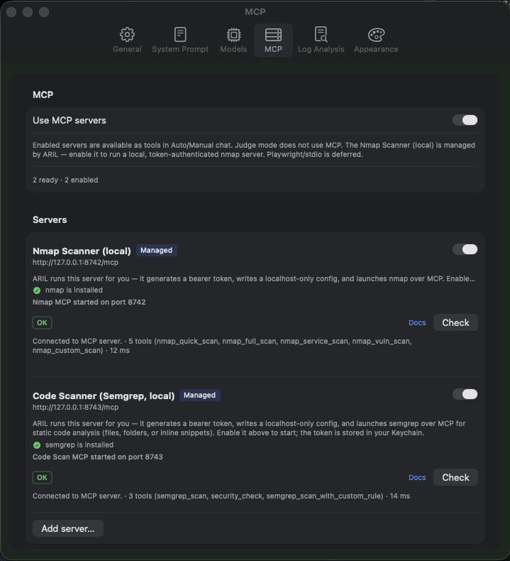
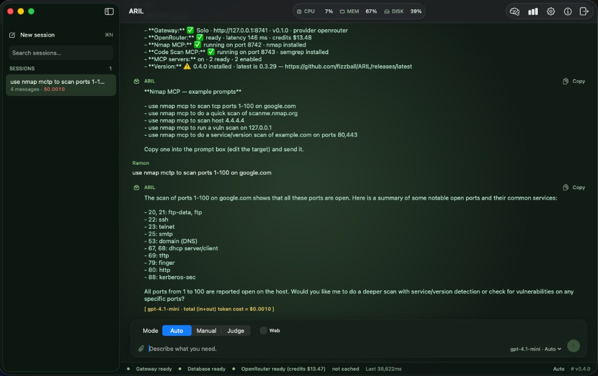

# ARIL 0.4.0 — Managed security scanners (Nmap + Semgrep, MCP)

Major feature release: ARIL can now run local **Nmap** (network/vuln) and
**Semgrep** (static code analysis) scanners for you as fully managed MCP servers,
usable directly from Auto/Manual chat.

Builds are signed with Developer ID and **notarized by Apple** — no Gatekeeper
workaround needed.

## Try it

1. Download **ARIL-0.4.0.dmg**, open it, and drag **ARIL** into **Applications**.
2. Launch ARIL (Solo mode starts the bundled gateway) and paste your OpenRouter key
   in **Preferences → General**.
3. Install nmap if you don't have it: `brew install nmap` (and `brew install semgrep`
   for code scanning).
4. **Preferences → MCP**: turn on **Use MCP servers**, then enable **Nmap Scanner (local)**.
   - ARIL generates a token, writes a localhost-only config, and launches the server.
   - The row shows "nmap is installed" and a start status once it's running.
5. In **Auto** or **Manual** chat, ask something like:
   *"Do a quick nmap scan of scanme.nmap.org"* or *"Run a vuln scan on 127.0.0.1"*.
   - The reply shows `Using Nmap Scanner (local) · nmap_quick_scan…` and the parsed results.

## What's new in 0.4.0

- **ARIL-managed Nmap MCP server.** Enabling the preset makes ARIL:
  - generate a 256-bit **bearer token** once and store it in the **Keychain**,
  - write a **`config.json`** (Application Support) pinned to **127.0.0.1** with that token,
  - **launch** the server from the bundled `aril-gateway` binary (a `nmap-mcp` subcommand — no extra dependencies), and
  - **health-check** it before marking it ready.
  So the token the server enforces and the token ARIL sends can never drift.
- **Tools:** `nmap_quick_scan`, `nmap_full_scan`, `nmap_service_scan`, `nmap_vuln_scan`
  (NSE `vuln` category — CVEs/misconfigs), and `nmap_custom_scan` for advanced flags.
- **nmap detection.** ARIL checks for the `nmap` binary and prompts `brew install nmap`
  when it's missing; scans return a clear install hint instead of failing silently.
- Results are parsed from nmap XML into a compact, model-friendly summary (hosts, open
  ports, services/versions, and NSE script findings).
- **Live scan progress.** Scans stream over Streamable HTTP SSE: nmap runs with
  `-v --stats-every 2s`, so discovered ports and percent-complete/ETC lines flow into the
  reply (`↳ …`) as the scan runs, instead of only appearing once it finishes.

- **ARIL-managed Semgrep code-scan MCP server.** Same no-drift model as Nmap
  (bearer token in Keychain + localhost-only `config.json` + `aril-gateway code-mcp`
  subcommand + health check). It wraps the local `semgrep` CLI and scans **both
  on-disk paths and inline code snippets**.
  - **Tools:** `semgrep_scan` (default `auto` ruleset, override via `config`),
    `security_check` (`p/security-audit`), and `semgrep_scan_with_custom_rule`
    (bring your own YAML rule — no registry needed).
  - **semgrep detection.** ARIL checks for the `semgrep` binary and prompts
    `brew install semgrep` (or `pipx install semgrep`) when missing.
  - Findings are parsed from Semgrep JSON into a compact report per finding
    (`[SEVERITY] check_id`, `path:line — message`, plus CWE/OWASP tags), and scan
    progress streams live over SSE just like Nmap.

## Productivity

- **Slash commands** in the prompt box. Type `/` to open a live command palette (↑/↓ to
  move, Enter to run, Tab to insert, Esc to dismiss; rows are also clickable):
  - `/status` — one-shot health check: gateway (version/provider), OpenRouter (ready,
    latency, remaining credits), the managed Nmap + Semgrep code-scan servers and their
    install state, MCP servers, and a GitHub check for the latest ARIL release vs the
    installed version.
  - `/nmap` and `/codescan` — drop in example prompts for the managed scanners; the
    palette description flags when the relevant MCP server is disabled.
  - `/clear` — clear the current chat transcript.
  - `/reset` — wipe **all** sessions and Learning data (including Category/Fingerprint
    Prefer win counts), behind a confirmation prompt.
  - `/exit` — cleanly shut down the gateway and quit ARIL.
  - `/help` — list the available commands.
- **Prompt history.** Press **↑ / ↓** in the prompt box to recall your last 10 prompts
  (shell-style). Multi-line drafts keep normal cursor movement.

## Images & reliability

- **Image generation fixed.** Prompts like *"draw me an image of the moon"* route to an
  image-capable model and no longer fail with a 502 / *"No endpoints found"* — ARIL now
  omits tool-calling on image turns (image models have no tool-capable endpoint).
- **Generated images persist across restarts.** Images are saved to disk as
  content-addressed `file://` links (shared by the gateway and app) instead of being
  dropped to a placeholder, and the session merge no longer clobbers real content.
- **Fewer Keychain prompts.** Managed MCP tokens are consolidated into a single cached
  Keychain item, so launch asks for authorization at most once.
- **Hardened Nmap XML parsing** with `defusedxml` (XXE mitigation).

## Security notes

- The server binds to **127.0.0.1 only** and requires the bearer token — it is not
  exposed on your network.
- The scan runs locally; **your Mac is the source** of the probes. Only test targets you
  own or are explicitly authorized to test.

## Under the hood

- The Nmap and Semgrep MCP servers are self-contained modules inside the gateway package
  (`services/aril-api/app/nmap_mcp/` and `app/codescan_mcp/`) that implement the MCP
  Streamable HTTP JSON-RPC protocol using the already-bundled FastAPI/uvicorn stack — so
  they freeze into the same PyInstaller binary and need no new Python dependencies or
  release-workflow changes.
- Lifecycle is handled by `NmapServerManager` / `CodeScanServerManager` (macOS app),
  mirroring the Solo `LocalGatewayManager` pattern (token/config generation, launch,
  health, recycle). Nmap listens on `127.0.0.1:8742`, Semgrep on `127.0.0.1:8743`.

## Security notes (code scanning)

- The Semgrep server also binds to **127.0.0.1 only** and requires its own bearer token.
- Inline code snippets are written to a temp directory that is deleted after each scan;
  the `filename` argument controls language detection.
- The default `auto` ruleset fetches community rules from the Semgrep registry on first
  use (network required); `default_config` in `config.json` can pin an offline/alternate
  ruleset, and the custom-rule tool avoids the registry entirely.
